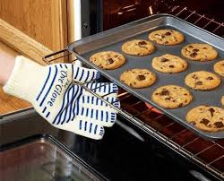
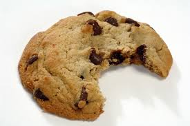

# INTRODUCTION

A Beginner's Guide to Baking Chocolate Chip Cookies. No Prior Baking Experience Necessary.

# THEORY

- Mixing the ingredients
- Cooking the dough at the right temperature
- Cooking the dough for the right length of time

# WARNING

Burns can cause serious or fatal injury. Be sure to wear oven mits whenever taking items in and out of a hot oven. 

# STEPS

### 1.) Preheat Oven to 375 Degrees Fahrenheit

### 2.) In Large Mixing Bowl Beat 1 Cup of Butter
**Note:** Once completed with this step butter should look smooth and creamy

### 3.) Add to Butter 1 Cup of Brown Sugar and 1/2 Cup of Granulated Sugar
**Note:** Granulated sugar is white sugar

### 4.) Mix Sugars and Butter 
**Note:** Sugar and butter mixture should look smooth after step 4

### 5.) Add 2 Eggs

### 6.) Add 1/2 tsp Vanilla Extract

### 7.) Mix Everything

### 8.) In a Separate Bowl, Mix Dry Ingredients
- 2 1/2 cups flour
- 1 tsp baking soda
- 1/8 tsp salt

### 9.) Add Dry Ingredients to Wet Ingredients and Mix 
**Note:** Wet Ingredients are ingredients described in steps 2-6

### 10.) Stir in 1 Bag of Chocolate Chips
**Note:** If using an electric mixer, remove beaters and stir in chocolate chips by hand

### 11.) With a Cookie Scoop Place Dough on Cookie Sheet
**Note:** Dough should be placed 1 inch apart

    
### 12.) Bake for 8 Minutes

# _**Enjoy**_

 
 
