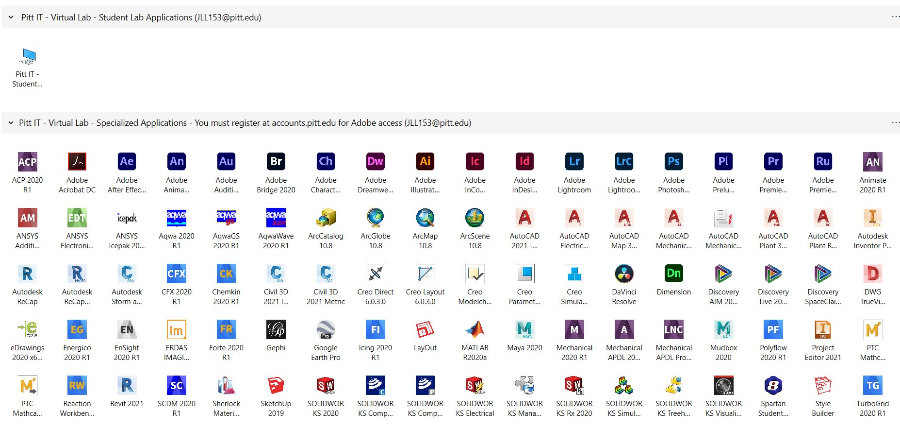

# INTRODUCTION

Working with Pitt's virtual lab platform to run ArcGIS and properly save work in University OneDrive.

# THEORY

Some ArcGIS applications take a lot of computing power to run. To avoid over-taxing your personal computer, students can use Pitt's Virtual Lab platform to access ArcGIS software.

# WARNING

Work not saved to proper location may be deleted.

# STEPS

### 1.) Log in to student portal
     
### 2.) Open Virtual Lab

### 3.) Select ArcMap application

    

### 4.) Open Catalog tab on the right-hand side of your screen

### 5.) Right click on 'Folder Connections'
     
### 6.) Select 'Connect to Folder'

     
### 7.) In 'Connect to Folder' window, select your OneDrive
**Note:** If you have a specific folder within your Onedrive you want your work saved to, select your OneDrive and then the folder name.

     
     
 

### 8.) Click OK
